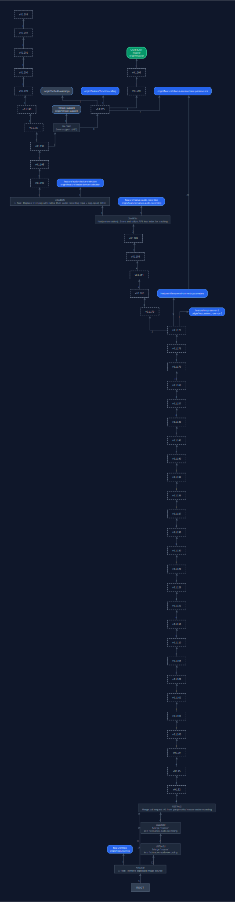

# GGV - Git Graph Visualizer

A Rust CLI tool that generates visual representations of Git repository structure using Graphviz DOT format and SVG output.


## Features

- **Comprehensive Visualization**: Displays commits, branches, remote branches, tags, and HEAD
- **Condensed Graph**: Only referenced commits (branch tips, tags, root, merge junctions) are shown — intermediate commits are skipped for clarity
- **Dual Theme**: Dark and light theme — branch nodes are color-coded by type (main, develop, feature/\*, release/\*, hotfix/\*); dark is the default, switch with `-t light`
- **Auto Fetch**: Runs `git fetch --tags --prune` before generating the graph to ensure tags are current and stale remote-tracking refs are removed
- **SVG Output**: Generates high-quality SVG images opened automatically in your default viewer
- **Ref Filtering**: Choose which ref types to include (local branches, remotes, tags, HEAD)
- **Current-Branch View**: `-c` hides all refs not on the ancestry path of HEAD — shows only what is reachable from the current checkout
- **Subtree View**: Limit the graph to a specific commit and all its descendants (`-F`)
- **Forge Integration**: Clickable graph edges linking to GitLab or GitHub compare views, with hover tooltips showing the condensed commits — auto-detected from the remote URL
- **Drag-to-Compare**: Drag any commit node onto another to open a GitLab or GitHub compare view for that arbitrary range — order is corrected automatically (always `older...newer`)
- **SHA Copy**: Click any commit node to copy its full 40-character SHA to the clipboard (amber border flash confirms)
- **Graph Tooltip**: Hover the SVG background to see the repository name, current branch, HEAD commit, author, and date
- **AI Diff Server**: Start a local web server (`-w`) that opens `git difftool` when you left-click an edge count label; right-clicking always offers AI diff options (full diff+log, diff-only, log-only)
- **Smart AI Diff**: AI summaries use merge-base detection to produce the correct snapshot diff (`git diff`) enriched with structured commit metadata (`git log`) passed to gia as additional context; a "diff-only" variant skips the log metadata for a more focused summary
- **Multilingual AI Output**: AI summaries are delivered in a configurable language (`-l`/`--lang`, e.g. `de-DE`, `en-US`, `fr-FR`); German is the default
- **Rendered AI Output**: AI diff summaries are rendered as a styled HTML page in the browser — gia outputs Markdown which is converted to HTML on the fly
- **Audio Input**: Microphone recording in gia is active by default; the voice input is treated as a filter or direction — e.g. "ignore test files" or "focus only on the API changes" — and is appended to the AI prompt; pass `-N` to disable
- **Cross-Platform**: Works on Windows, macOS, and Linux

## Prerequisites

- Rust toolchain (1.70+)
- **Graphviz**: Must be installed — `dot.exe` is called directly

  | Platform | Command |
  |----------|---------|
  | Windows (winget) | `winget install --id Graphviz.Graphviz` |
  | Windows (Chocolatey) | `choco install graphviz` |
  | Windows (manual) | [graphviz.org/download](https://graphviz.org/download/) |
  | macOS | `brew install graphviz` |
  | Linux (Debian/Ubuntu) | `sudo apt install graphviz` |

  On Windows, GGV searches for `dot.exe` automatically in the standard installation directories.
  If installed in a non-standard location, set the `GRAPHVIZ_DOT` environment variable:

  ```bat
  set GRAPHVIZ_DOT=C:\MyTools\Graphviz\bin\dot.exe
  ```

- **gia** (optional): Required for AI diff summaries (`-w -a`). Must be available in `PATH`.
  See [github.com/panjamo/gia](https://github.com/panjamo/gia).



## Installation

```bash
cargo build --release
```

The binary will be available at `target/release/ggv`.

## Usage

### Basic Usage

```bash
ggv
```

### Command-Line Options

```
ggv [OPTIONS]

Options:
  -r, --repo-path <PATH>    Path to Git repository [default: .]
  -o, --output <FILE>       Output DOT file path [default: ggv-<repo-name>.dot]
  -n, --no-show             Skip SVG generation and opening
  -f, --filter <CHARS>      Ref types: b=branches, r=remotes, t=tags, h=head [default: brt]
  -g, --gitlab-url <URL>    Base URL for compare links — GitLab or GitHub (auto-detected)
  -F, --from <COMMIT>       Limit graph to this commit and its descendants
  -X, --no-fetch            Skip automatic 'git fetch --tags --prune'
  -k, --keep-dot            Keep the intermediate DOT file after SVG generation
  -t, --theme <THEME>       Color theme: dark or light [default: dark]
  -c, --current-branch      Show only refs that are ancestors of HEAD
  -w, --web-server          Start the diff web server
  -P, --web-port <PORT>     Port for the diff server (0 = OS-assigned) [default: 0]
  -p, --gia-prompt <TEXT>   Custom prompt passed to gia (overrides built-in default)
  -l, --lang <LOCALE>       Language locale for AI output (e.g. de-DE, en-US, fr-FR) [default: de-DE]
  -N, --no-gia-audio        Deactivate microphone audio recording in gia
  -h, --help                Print help
  -V, --version             Print version
```

### Examples

Generate graph for the current repository:

```bash
ggv
```

Generate graph for a specific repository:

```bash
ggv -r /path/to/repo
```

Generate DOT file only, no SVG:

```bash
ggv -n
```

Skip the automatic tag fetch (faster, offline):

```bash
ggv -X
```

Keep the intermediate DOT file alongside the SVG:

```bash
ggv -k
```

Show only local branches (no remotes, no tags):

```bash
ggv -f b
```

Show branches and tags but not remotes:

```bash
ggv -f bt
```

Override the forge URL for clickable compare links:

```bash
ggv -g https://gitlab.com/mygroup/myproject
ggv -g https://github.com/owner/repo
```

Show only the history from a specific commit onwards:

```bash
ggv -F abc1234
ggv -F feature/my-branch
ggv -F v2.0.0
```

Use the light theme:

```bash
ggv -t light
```

Show only the current branch:

```bash
ggv -c
```

Combine subtree with current-branch view:

```bash
ggv -F v1.0.0 -c
```

### Diff Web Server

Start the diff server alongside the graph. With `-w`, the SVG is served via the local web server (`http://[::1]:<port>/view`) instead of opened as a file, enabling same-origin requests for the context menu. Clicking the blue edge count label triggers the configured diff action.

Left-clicking a count label opens `git difftool -d sha1 sha2` in your configured diff tool. Right-clicking a count label gives AI diff options. AI summaries use merge-base detection; commit metadata (author, date, refs, changed files) is passed to gia as additional context:

```bash
ggv -w
```

Use a fixed port (useful when the SVG will be reopened later):

```bash
ggv -w -P 8080
```

Use a custom prompt:

```bash
ggv -w -p "list the changed files and explain each change in one sentence"
```

Set AI output language (default is German):

```bash
ggv -w --lang en-US
ggv -w --lang fr-FR
```

Deactivate audio input — gia will not record from the microphone:

```bash
ggv -w -N
```

Combined:

```bash
ggv -w -p "summarize in three bullet points"
ggv -w --lang en-US
ggv -w -N --lang en-US
```

The process stays alive after the SVG is opened, serving requests until Ctrl+C. Each `ggv -w` instance gets its own OS-assigned port, so multiple instances can run simultaneously.

## Output

1. **SVG file** (`ggv-<repo-name>.svg`): Visual graph opened automatically in your default viewer.
   The intermediate DOT file is deleted after SVG generation unless `-k` is set.
2. With `-n`: only the **DOT file** is written (`ggv-<repo-name>.dot`).

### Graph Elements

Branch nodes are rounded rectangles, color-coded by name. Two built-in themes are available:

#### Dark theme (`-t dark`, default) — background `#0F172A`

| Branch pattern | Fill | Border | Text |
|----------------|------|--------|------|
| `main` / `master` | `#059669` | `#34D399` | `#F0FDF4` |
| `develop` | `#7C3AED` | `#A78BFA` | `#F5F3FF` |
| `feature/*` | `#2563EB` | `#60A5FA` | `#EFF6FF` |
| `release/*` | `#D97706` | `#FBBF24` | `#FFFBEB` |
| `hotfix/*` | `#DC2626` | `#F87171` | `#FEF2F2` |
| other | `#334155` | `#60A5FA` | `#E2E8F0` |

#### Light theme (`-t light`) — background `#F8FAFC`

| Branch pattern | Fill | Border | Text |
|----------------|------|--------|------|
| `main` / `master` | `#ECFDF5` | `#10B981` | `#065F46` |
| `develop` | `#F3E8FF` | `#8B5CF6` | `#5B21B6` |
| `feature/*` | `#EFF6FF` | `#3B82F6` | `#1E40AF` |
| `release/*` | `#FFF7ED` | `#F59E0B` | `#92400E` |
| `hotfix/*` | `#FEF2F2` | `#EF4444` | `#7F1D1D` |
| other | `#F8FAFC` | `#64748B` | `#334155` |

#### Common elements

| Element | Dark | Light |
|---------|------|-------|
| Tag node | Dashed `#94A3B8` border | Dashed `#94A3B8` border, transparent fill |
| Current checkout | 2px border + `CURRENT` label | 2px border + `CURRENT` label |
| Plain commit / junction | Dark slate panel | White panel, `#E2E8F0` border |
| Edges | `#475569` | `#CBD5E1` |

### SVG Interactions

Open the SVG in a browser to use all interactive features:

| Interaction | Result |
|-------------|--------|
| Hover an edge | Tooltip listing commits condensed into that range |
| Click an edge | Opens the GitLab / GitHub compare view for that range |
| Hover the blue edge count label | Tooltip listing the files changed between the two nodes |
| Click the blue edge count label | Opens `git difftool` (requires `-w`) |
| Right-click the blue edge count label | Context menu with AI diff options: full diff+log, diff-only, log-only (requires `-w`) |
| Click a commit node | Copies the full 40-character SHA to the clipboard (amber flash confirms) |
| Drag one commit node onto another | Opens the forge compare view for that range — always `older...newer` |
| Ctrl + drag onto another node | Opens the diff web server diff for that range (requires `-w`) |
| Hover the SVG background | Tooltip with repository name, branch, HEAD commit, author, and date |
| Right-click a commit node | Context menu (requires `-w`) |

#### Right-click context menu on commit nodes (requires `-w`)

When the diff web server is active, right-clicking any commit node opens a context menu:

| Item | Action |
|------|--------|
| Select as first node / Change first node | Pin this commit as the "from" end of a manual compare range |
| Clear selection | Unpin the currently pinned commit |
| Compare with \<sha\>… | Open diff web server diff for the pinned–current range |
| Compare with AI – \<sha\>… | AI summary (diff + log metadata) for the pinned–current range |
| Compare with AI diff – \<sha\>… | AI summary using diff only (no log metadata) |
| Compare with AI log – \<sha\>… | AI summary using log metadata only |
| Show Git Log – \<sha\>… | Show formatted `git log` between pinned and current commit |
| Copy SHA | Copies the full 40-character SHA to the clipboard |
| Copy branch: \<name\> | Copies the local or remote branch name |
| Copy tag: \<name\> | Copies the tag name |
| Delete local: \<name\> | Force-deletes the local branch (`git branch -D`) after confirmation |
| Delete remote: \<name\> | Pushes a remote branch deletion (`git push <remote> --delete <branch>`) after confirmation |
| Checkout branch | Runs `git checkout <branch>` for the branch at that commit |

Branch and tag names are read directly from structured metadata embedded in the SVG — no text parsing heuristics.

#### Right-click context menu on edge count labels (requires `-w`)

| Item | Action |
|------|--------|
| AI Summary of Changes | AI diff+log summary via gia — shown in a new browser tab |
| AI Summary (diff only) | AI summary using only the diff, no commit log metadata |

Drag-to-compare requires a forge URL (auto-detected or set via `-g`). The blue edge count labels and context menus are only active when `-w` is used. Left-clicking a count label always opens `git difftool`.

## Development

### Build Commands

```bash
cargo build           # Development build
cargo build --release # Release build
cargo run             # Run with default options
cargo run -- -r /path/to/repo -f b
```

### Code Quality

```bash
cargo clippy --fix --allow-dirty
cargo fmt
cargo check
```

### Development Workflow

1. Make changes
2. `cargo clippy --fix --allow-dirty`
3. `cargo fmt`
4. `cargo build`
5. `cargo run`
6. Commit

## Dependencies

- **git2** — Git repository operations
- **clap** — CLI argument parsing
- **anyhow** — Error handling
- **chrono** — Date/time formatting
- **pulldown-cmark** — Markdown to HTML rendering for AI summaries

## Architecture

See `CLAUDE.md` for detailed architecture documentation.

## License

[Specify your license here]

## Contributing

Contributions welcome. Please ensure code passes `cargo clippy` and `cargo fmt` before submitting.
