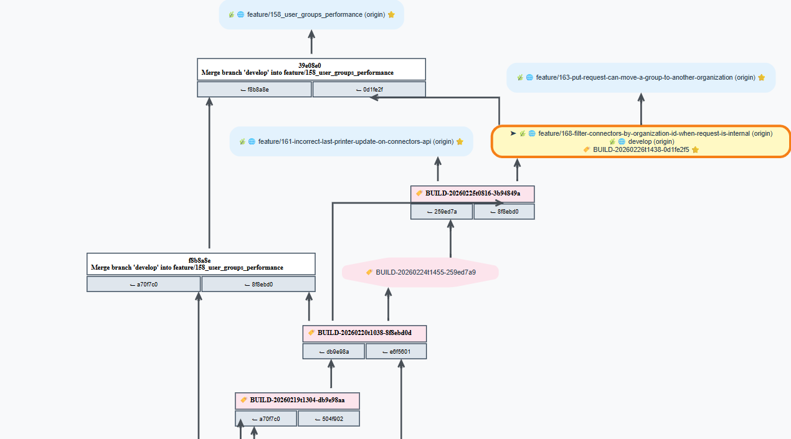

# GGV - Git Graph Visualizer

A Rust CLI tool that generates visual representations of Git repository structure using Graphviz DOT format and SVG output.


## Features

- **Comprehensive Visualization**: Displays commits, branches, remote branches, tags, and HEAD
- **Condensed Graph**: Only referenced commits (branch tips, tags, root, merge junctions) are shown — intermediate commits are skipped for clarity
- **Dual Theme**: Dark (default) and light theme — branch nodes are color-coded by type (main, develop, feature/\*, release/\*, hotfix/\*); switch with `--theme light`
- **Auto Fetch**: Runs `git fetch --tags --prune` before generating the graph to ensure tags are current and stale remote-tracking refs are removed
- **SVG Output**: Generates high-quality SVG images opened automatically in your default viewer
- **Ref Filtering**: Choose which ref types to include (local branches, remotes, tags, HEAD)
- **Current-Branch View**: `--current-branch` hides all refs not on the ancestry path of HEAD — shows only what is reachable from the current checkout
- **Subtree View**: Limit the graph to a specific commit and all its descendants (`--from`)
- **Forge Integration**: Clickable graph edges linking to GitLab or GitHub compare views, with hover tooltips showing the condensed commits — auto-detected from the remote URL. Ref names are URL-encoded. GitHub links use commit SHAs for reliability.
- **SHA Copy**: Click any commit node to copy its full SHA to the clipboard (amber flash confirms the copy)
- **Graph Tooltip**: Hover the SVG background to see the repository name, current branch, HEAD commit, author, and date
- **Cross-Platform**: Works on Windows, macOS, and Linux

## Prerequisites

- Rust toolchain (1.70+)
- **Graphviz**: Must be installed — `dot.exe` is called directly

  | Platform | Command |
  |----------|---------|
  | Windows (winget) | `winget install --id Graphviz.Graphviz` |
  | Windows (Chocolatey) | `choco install graphviz` |
  | Windows (manual) | [graphviz.org/download](https://graphviz.org/download/) |
  | macOS | `brew install graphviz` |
  | Linux (Debian/Ubuntu) | `sudo apt install graphviz` |

  On Windows, GGV searches for `dot.exe` automatically in the standard installation directories.
  If it is installed in a non-standard location, set the `GRAPHVIZ_DOT` environment variable:

  ```bat
  set GRAPHVIZ_DOT=C:\MyTools\Graphviz\bin\dot.exe
  ```



## Installation

```bash
cargo build --release
```

The binary will be available at `target/release/ggv`.

## Usage

### Basic Usage

Generate a graph of the current repository and open it:

```bash
cargo run
```

Or using the compiled binary:

```bash
ggv
```

### Command-Line Options

```
ggv [OPTIONS]

Options:
  -r, --repo-path <PATH>       Path to Git repository [default: .]
  -o, --output <FILE>          Output DOT file path [default: ggv-<repo-name>.dot]
      --no-show                Skip SVG generation and opening
  -f, --filter <CHARS>         Ref types to include: b=branches, r=remotes, t=tags, h=head [default: brt]
      --gitlab-url <URL>       Base URL for clickable compare links — GitLab or GitHub
                               (auto-detected from remote if not specified)
      --from <COMMIT>          Limit graph to this commit and its descendants
                               (accepts commit hash, branch name, or tag)
      --current-branch         Show only refs that are ancestors of HEAD (hides parallel branches)
      --no-fetch               Skip automatic 'git fetch --tags --prune' before generating the graph
      --keep-dot               Keep the intermediate DOT file after SVG generation
      --theme <THEME>          Color theme: dark or light [default: light]
  -h, --help                   Print help
  -V, --version                Print version
```

### Examples

Generate graph for the current repository:

```bash
ggv
```

Generate graph for a specific repository:

```bash
ggv --repo-path /path/to/repo
```

Generate DOT file only, no SVG:

```bash
ggv --no-show
```

Skip the automatic tag fetch and prune (faster, offline):

```bash
ggv --no-fetch
```

Keep the intermediate DOT file alongside the SVG:

```bash
ggv --keep-dot
```

Show only local branches (no remotes, no tags):

```bash
ggv --filter b
```

Show branches and tags but not remotes:

```bash
ggv --filter bt
```

Override the base URL for clickable compare links (GitLab or GitHub):

```bash
ggv --gitlab-url https://gitlab.com/mygroup/myproject
ggv --gitlab-url https://github.com/owner/repo
```

Show only the history from a specific commit onwards (new root):

```bash
ggv --from abc1234
```

Use a branch name or tag as the new root:

```bash
ggv --from feature/my-branch
ggv --from v2.0.0
```

Combine with filtering — show only local branches descending from a tag:

```bash
ggv --from v1.0.0 --filter b
```

Use the light theme (GitHub Light / Linear style):

```bash
ggv --theme light
```

Show only the current branch (hide all parallel branches and their remotes/tags):

```bash
ggv --current-branch
```

Combine with `--from` to scope both the starting point and the visible branches:

```bash
ggv --from v1.0.0 --current-branch
```

## Output

1. **SVG file** (`ggv-<repo-name>.svg`): Visual graph opened automatically in your default viewer.
   The intermediate DOT file is deleted after SVG generation unless `--keep-dot` is set.
2. With `--no-show`: only the **DOT file** is written (`ggv-<repo-name>.dot`).

### Graph Elements

Branch nodes are rounded rectangles, color-coded by name. Two built-in themes are available:

#### Dark theme (`--theme dark`, default) — background `#0F172A`

| Branch pattern | Fill | Border | Text |
|----------------|------|--------|------|
| `main` / `master` | `#059669` | `#34D399` | `#F0FDF4` |
| `develop` | `#7C3AED` | `#A78BFA` | `#F5F3FF` |
| `feature/*` | `#2563EB` | `#60A5FA` | `#EFF6FF` |
| `release/*` | `#D97706` | `#FBBF24` | `#FFFBEB` |
| `hotfix/*` | `#DC2626` | `#F87171` | `#FEF2F2` |
| other | `#334155` | `#60A5FA` | `#E2E8F0` |

#### Light theme (`--theme light`) — background `#F8FAFC`

| Branch pattern | Fill | Border | Text |
|----------------|------|--------|------|
| `main` / `master` | `#ECFDF5` | `#10B981` | `#065F46` |
| `develop` | `#F3E8FF` | `#8B5CF6` | `#5B21B6` |
| `feature/*` | `#EFF6FF` | `#3B82F6` | `#1E40AF` |
| `release/*` | `#FFF7ED` | `#F59E0B` | `#92400E` |
| `hotfix/*` | `#FEF2F2` | `#EF4444` | `#7F1D1D` |
| other | `#F8FAFC` | `#64748B` | `#334155` |

#### Common elements

| Element | Dark | Light |
|---------|------|-------|
| Tag node | Dashed `#94A3B8` border, 1px | Dashed `#94A3B8` border, 1.5px, transparent fill |
| Current checkout | 2px border + `CURRENT` label | 2px border + `CURRENT` label |
| Plain commit / junction | Dark slate panel | White panel, `#E2E8F0` border |
| Edges | `#475569` | `#CBD5E1` |

Each branch and remote-tracking ref is shown on its own line (e.g. `main` and `origin/main` as separate entries).
Hovering an edge shows a tooltip listing the commits condensed into that range.
Clicking an edge (in a browser) opens the GitLab or GitHub compare view for that range.
Clicking a commit node copies its full 40-character SHA to the clipboard; the node border flashes amber to confirm.
Hovering the SVG background shows a tooltip with the repository name, current branch, HEAD commit, author, and date.

## Development

### Build Commands

```bash
cargo build           # Development build
cargo build --release # Release build
cargo run             # Run with default options
cargo run -- --repo-path /path/to/repo --filter b
```

### Code Quality

```bash
cargo clippy --fix --allow-dirty
cargo fmt
cargo check
```

### Development Workflow

1. Make changes
2. `cargo clippy --fix --allow-dirty`
3. `cargo fmt`
4. `cargo build`
5. `cargo run`
6. Commit

## Dependencies

- **git2** — Git repository operations
- **clap** — CLI argument parsing
- **anyhow** — Error handling
- **chrono** — Date/time formatting

## Architecture

See `CLAUDE.md` for detailed architecture documentation.

## License

[Specify your license here]

## Contributing

Contributions welcome. Please ensure code passes `cargo clippy` and `cargo fmt` before submitting.
